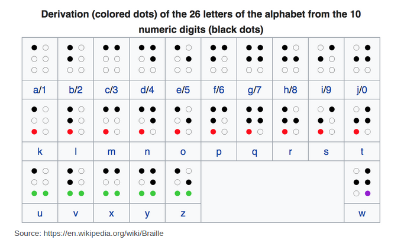

# Lab 14 (Evaluative)

## Learning objectives

* Working with File IO
* Working with arrays of strings
* Solving a large problem by breaking it down into smaller functions

## Starting point

The given starter code compiles but leads to a runtime error. Make sure you understand the given code.

Use the shortcut `Ctrl` + `Shift` + `V` to render the README.md file.

DO NOT CHANGE

* the definitions of any functions not marked with `//TODO` and
* the headers of any given functions.

You can create new helper functions if you want. You can include additional libraries.

DO NOT SEEK HELP FROM ANYONE, INCLUDING TAs.

## Background

[Braille](https://en.wikipedia.org/wiki/Braille) is a tactile writing system used by people with visual impairment. It is traditionally written with embossed paper and on signage. Braille users can read computer screens using refreshable braille displays. They can write braille with the original slate and stylus or type it on a braille writer, such as a portable braille notetaker or computer that prints with a braille embosser.

Braille was the first writing system with binary encoding. The system, as devised by Braille, consists of two parts:

* Character encoding that mapped characters of the alphabet to arrays of six bits.
* The physical representation of those six-bit characters with raised dots in a braille cell.

1. Within an individual cell, the dot positions are arranged in two columns of three positions. A raised dot can appear in any of the six positions, producing sixty-four (26) possible patterns, including one in which there are no raised dots.
2. A pattern is commonly described by listing the positions where dots are raised, the positions being universally numbered, from top to bottom, as 1 to 3 on the left and 4 to 6 on the right. For example, dot pattern 1-3-4 describe a cell with three dots raised, at the top and bottom in the left column and at the top of the right column: that is, the letter ⡉ m
3. The first ten letters of the alphabet, a–j, use the upper four dot positions: ⠁⠃⠉⠙⠑⠋⠛⠓⠊⠚ (black dots in the table below).
4. The next ten letters, k–t, are identical to a–j, respectively, apart from the addition of a dot at position 3 (red dots in the table): ⠅⠇⠍⠝⠕⠏⠟⠗⠎⠞
5. The next ten letters (the next "decade") are the same again, but with dots also at positions both 3 and 6 (green dots). Here w was left out as not being a part of the official French alphabet at the time of Braille's life.
6. Space in Braille is represented by a cell with no dots raised.



Try out this [online Braille generator](http://www.byronknoll.com/braille.html) to get a feel of translating English to Braille. Enter lowercase text to match our assignment.

---

Make sure you understand the problem statement given below.

### Our simplified representation of Braille

For the sake of this assignment, we represent Braille characters as an array of 6 characters, `.` representing the raised dots and `-` representing the not raised ones. So, `'a'` is represented as `".-----"` and displayed as:

```txt
.-
--
--
```

and `'0'` as `"-.-..-"` and displayed as:

```txt
-.
..
--
```

## Tasks

### Task 0

Rename the `.c` file to `YOURBITSID.c`.
Ensure that the YOURBITSID matches your ID on quanta, or in other words, the 'Campus ID' on the lab seating arrangement shared with you.

### Compilation instructions

You should know these by now, but here is a command to compile your program:

```sh
gcc YOURBITSID.c -o lab14
```

and a command to run the compiled program:

```sh
./lab14
```

### Task 1

Implement `map_index` to match its description.

Read the given `generate_map` function. See how it creates a ASCII to Braille map stored as an array of 27 strings; 26 letters and the `<SPACE>` character. Since the digits double down on the first ten characters, these 27 should suffice.
Each of these 27 strings is of size 7, six characters for the Braille dots described above and the seventh for `'\0'`.

Test `map_index` by addding/uncommenting/commenting certain lines in `main`.

Then, uncomment the line `display_map(map);` in `main` to see the entire map.

### Task 2

Implement the functions `can_translate_to_braille`, `ascii_to_braille`, and `fputc_braille`.
Testing them thoroughly will give you confidence that your 'option-1' is implemented. Unless you are sure about it, don't move on to the next task as it depends on this.

### Task 3

Now move on to option-2.
First implement the `open_file_given_mode` function and then the `translate_ascii_to_braille` function to match their descriptions.
Test them thoroughly to convince yourself that your code is correct.

Note, you need to open the `outfile` in the `w+` mode so we can print out its contents to the console at the end. This is needed for the `autograder` script.

## Submit

We have provided some test cases with the code.
You can test your program against these by running the following command in the terminal:

```python
python3 autograder.py YOURBITSID.c Lab14-tests.json
```

We will run your submission against several other test cases - you should test your code for other input combinations before submitting.

### Prepare Submission

1. First, make sure the .c file is renamed properly and works as expected.
2. Also ensure all your debugging statements are commented out and you have no extra print statements anywhere.
3. Run the following command in the terminal to make the program to prepare submission an executable:

   ```sh
   chmod 700 prepare_submission
   ```

4. Execute that program to produce the submission file `YOURBITSID.tar.gz`:

   ```sh
   ./prepare_submission
   ```

5. Upload the created file to the appropriate assignment on <https://quanta.bits-goa.ac.in/>.
   Be sure to leave the 'Save As' option blank while uploading the your solution on quanta.
