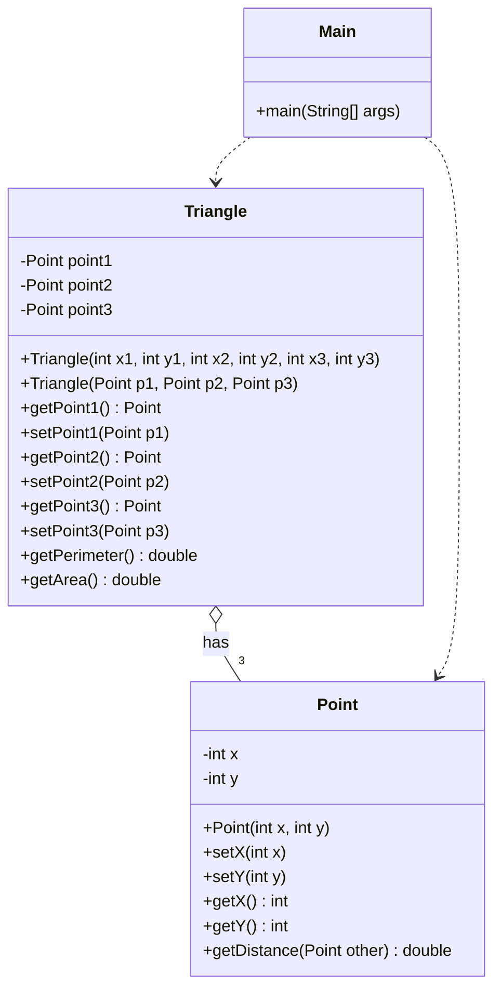

```mermaid 

classDiagram
    class Point {
        -int x
        -int y
        +Point(int x, int y)
        +setX(int x)
        +setY(int y)
        +getX() int
        +getY() int
        +getDistance(Point other) double
    }
    
    class Triangle {
        -Point point1
        -Point point2
        -Point point3
        +Triangle(int x1, int y1, int x2, int y2, int x3, int y3)
        +Triangle(Point p1, Point p2, Point p3)
        +getPoint1() Point
        +setPoint1(Point p1)
        +getPoint2() Point
        +setPoint2(Point p2)
        +getPoint3() Point
        +setPoint3(Point p3)
        +getPerimeter() double
        +getArea() double
    }

    class Main {
        +main(String[] args)
    }

    Triangle o-- "3" Point : has
    Main ..> Point
    Main ..> Triangle

```