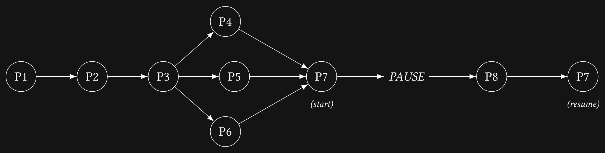

# Lab03

## Preface

**Creed Smitty** developed a very convenient fever before the previous lab. **Prof. Corn Bob Saul** saw through the excuse and asked **TA Arnold Add-a-TV** to put together a take-home assignment to test his knowledge of system calls.

Arnold knew Creed had a traumatic experience from DSA labs and would be terrified by any mention of a graph. So he designed a _simple_ process-scheduling assignment, with all the dependencies conveniently laid out as a graph.

Now you have to help Creed resolve those dependencies before he develops an actual fever at the sight of another graph.

## The Task

You are given 8 worker programs, `prog1` through `prog8`, that print a line when they start and a line when they finish. **You are not writing these programs. Do not modify the program files.**

Your job is to write the orchestrator (`main.c`) that spawns them in the order required by this dependency graph:



The graph is fixed. It is always these 8 processes in this order. `argv[1]` is just the path to the directory containing the program binaries; it has nothing to do with the graph itself.

### Stage A: Serial

Run P1, P2, and P3 one after another, each starting only once the previous one has finished.

### Stage B: Parallel

Once P3 finishes, start P4, P5, and P6 together, then wait for all three before moving on.

### Stage C: Pause / Resume

Once P4, P5, and P6 have all finished, start P7. Exactly 3 seconds after starting it, pause P7. Run P8 to completion, then resume P7 and let it finish. If P8 fails or times out, do not resume P7; terminate it instead.

### Error and Timeout Handling

For every child process except P7, check how it exited and how long it took.

- If a process exits with a non-zero status, print

  ```
  ERROR: P<id> exited with code <code>
  ```

- If a process does not finish within 5 seconds of being started, terminate it and print

  ```
  TIMEOUT: P<id> exceeded 5s
  ```

If a process fails or times out, do not start any process that depends on it. For example, if P2 fails, P3 must not start.

As stated above, P7 is fully exempt from these two rules. Just wait for it to finish normally after it is resumed.

## Where to Start

Edit `main.c`. `TIME_LIMIT_SECONDS` (5) and `PAUSE_AFTER_SECONDS` (3) are already defined.

Useful man pages:

- `man 2 fork`
- `man exec`
- `man 2 wait`
- `man 2 kill`

## Building and Testing

Run the public tests with:

```sh
make test
```

To remove build output:

```sh
make clean
```

The public tests are there to help you check your implementation. Additional tests will be run during grading.

## Submission

Submit **only `main.c`** on Quanta.

## Compiler Warning

You may see this warning when building:

```
warning: '/prog' directive output may be truncated
```

It comes from the path-construction code already provided in the skeleton and is not related to the task. You can safely ignore it. **Do not modify the provided path-construction code.**
